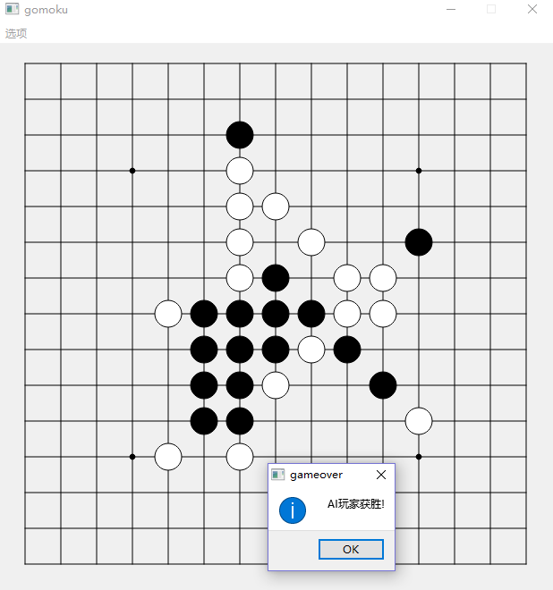

# gomoku:五子棋
## 简介
 Qt编写的五子棋人机对战GUI，电脑棋手名为alphaMiao，alphaMiao用博弈树进行搜索，并使用alpha-beta剪枝削减搜索空间。由于棋面局势的评价函数比较草率，所以alphaMiao目前被调教的还不是很到位。
## code说明
* **Qt_project**：Qt工程文件
* **executable_file_for_win**：我自己在windows上编译的可执行文件，可直接运行executable_file_for_win中的gomoku.exe。

## 效果截屏
